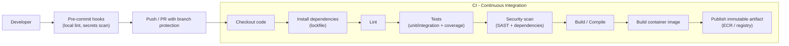
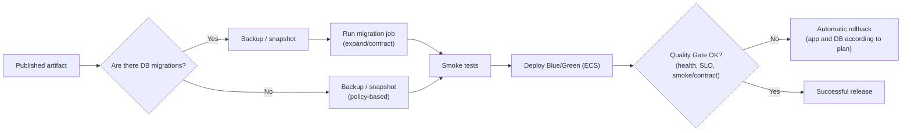
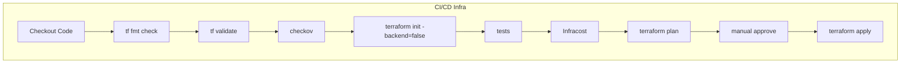

# CI/CD Pipeline (AWS) - EverShop

This pipeline proposes a **Continuous Integration (CI)** and **Continuous Delivery/Deployment (CD)** flow based on DevOps best practices:

- Early quality and security validation.
- Versioned and immutable artifacts.
- Environment promotion with quality gates.
- Manual approval before production.
- Observability and controlled rollback.

## CI Diagram for Application Code

## CD Diagram for Application Deployment

## Only for Infrastructure CI/CD Diagram (Terraform + AWS)

## Applied DevOps Recommendations

- **Pipeline as Code**: define CI/CD in versioned files.
- **Mandatory gates**: block promotion if quality, tests, or security checks fail.
- **Single promoted artifact**: the same build moves across all environments.
- **Shift-left security**: early scanning in CI.
- **Traceability**: link commit, build, image, deployment, and release.
- **Tested rollback**: strategy and automation for fast recovery.
- **Observability**: metrics, logs, traces, and post-deployment alerts.
